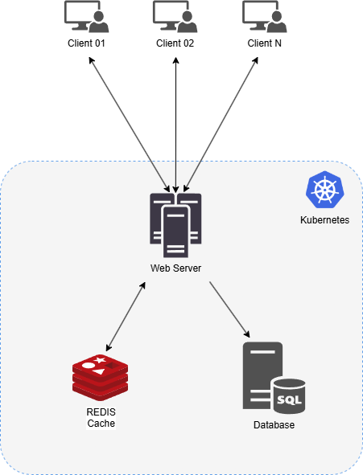

# Drawpad

> Quadro colaborativo em tempo real.

---

## Sobre o Projeto

**Drawpad** é uma aplicação web colaborativa de quadro branco em tempo real, inspirada no [Dontpad](https://dontpad.com/). Basta digitar o nome de uma sala e começar a desenhar. Qualquer pessoa com o mesmo identificador de sala pode se juntar e colaborar instantaneamente, sem necessidade de cadastro.

O foco é ser **rápido**, **simples** e **colaborativo**, com suporte a múltiplas conexões simultâneas e sincronização em tempo real via WebSocket.

---

## Funcionalidades

- **Acesso por sala**: entre em qualquer sala digitando seu identificador, sem login
- **Ferramentas de desenho**: pincel livre, círculos e retângulos
- **Sincronização em tempo real**: alterações propagadas instantaneamente para todos na sala via WebSocket
- **Persistência de dados**: os desenhos ficam salvos no banco de dados e em cache

---

## Arquitetura

### Diagrama de Fluxo

O diagrama abaixo descreve os principais componentes e a comunicação entre eles:



### Componentes

| Componente         | Responsabilidade                                              |
| ------------------ | ------------------------------------------------------------- |
| **Frontend**       | Interface do canvas, ferramentas de desenho, WebSocket client |
| **Servidor**       | API HTTP + WebSocket server, roteamento de eventos por sala   |
| **Redis (Cache)**  | Armazenamento rápido dos desenhos de cada sala (TTL: 1h)      |
| **Banco de Dados** | Persistência permanente das figuras                           |

---

## Fluxos de Comunicação

### 1. Fluxo Geral

```
Cliente → digita o ID da sala → entra na sala
         → GET /api/v1/rooms/:id  → Servidor consulta Redis
                                   → (miss) consulta Banco de Dados
         → carrega desenhos     → inicia conexão WebSocket (/cable)
         → ação no canvas       → evento WS "draw" → Servidor
                                   → salva no PostgreSQL
                                   → invalida cache Redis
                                   → broadcast para todos na sala
```

---

### 2. Fluxo de Entrada na Sala

```
1. Cliente acessa o site e informa o ID da sala
2. Frontend envia requisição HTTP GET /api/v1/rooms/:id
3. Servidor busca ou cria a sala no banco de dados
4. Servidor consulta os desenhos no cache Redis
5. (Cache miss) Servidor consulta o banco de dados e repovoar cache
6. Servidor retorna todos os desenhos existentes
7. Frontend renderiza os desenhos no canvas
```

---

### 3. Fluxo de Sincronização em Tempo Real

```
1. Após carregar os dados iniciais, cliente abre conexão WebSocket em /cable
2. Cliente se inscreve no DrawingChannel com { room_id: "nome-da-sala" }
3. Servidor inscreve o cliente no stream "drawing_room_<id>"
4. Conexão WebSocket permanece ativa para troca de eventos
5. Todos os clientes na mesma sala recebem atualizações instantâneas via broadcast
```

---

### 4. Fluxo de Criação de Figura

```
1. Usuário desenha uma figura no canvas
2. Cliente envia ação WebSocket perform("draw", { room_id, figure_type, data })
3. Servidor valida os dados recebidos
4. Servidor persiste a figura no PostgreSQL
5. Servidor invalida o cache Redis da sala
6. Servidor faz broadcast do evento "new_figure" para todos os clientes da sala
7. Clientes atualizam o canvas em tempo real
```

---

### 5. Fluxo de Reconexão

```
1. Cliente perde conexão com o servidor
2. Action Cable tenta reconectar automaticamente
3. Após reconexão, frontend refaz GET /api/v1/rooms/:id para re-sincronizar
4. Servidor retorna os dados mais recentes (cache hit ou miss)
5. Frontend descarta figuras pendentes locais e re-renderiza o canvas
```

---

## Tecnologias Utilizadas

| Camada         | Tecnologia                                  |
| -------------- | ------------------------------------------- |
| Frontend       | React 19 · TypeScript · Vite · Tailwind CSS |
| WebSocket      | Action Cable (Rails)                        |
| Backend        | Ruby on Rails 7.2 (API mode)                |
| Cache          | Redis                                       |
| Banco de Dados | PostgreSQL                                  |

---

## Como Rodar o Projeto

Instruções detalhadas para instalar dependências, subir a infraestrutura com Docker e iniciar o back-end e front-end estão em:

📄 **[SETUP.md](SETUP.md)**

---

## Interfaces de Comunicação

As interfaces HTTP REST e WebSocket utilizadas para comunicação entre frontend e backend estão documentadas em detalhes no arquivo:

📄 **[INTERFACES.md](INTERFACES.md)**

O documento cobre estruturas de dados, payloads de cada mensagem, diagramas de sequência e a estratégia de cache.

---

## Licença

Este projeto está sob a licença MIT. Veja o arquivo [LICENSE](LICENSE) para mais detalhes.
